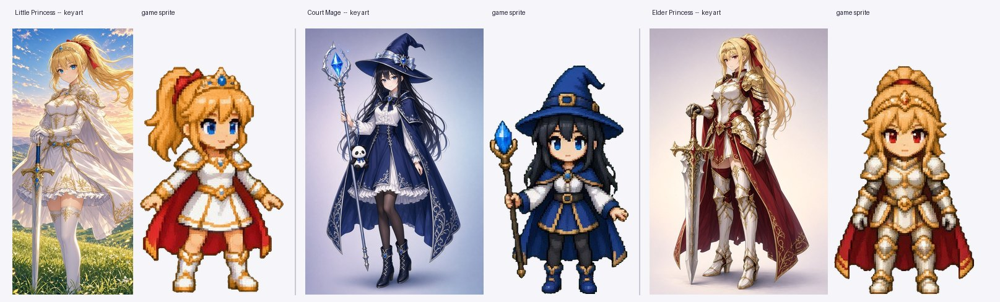

# 動作圖批次規格（給 Grok）

目標：把每個動作補到夠格數，動起來才順；同時把大小、比例、服裝的變異壓到最低。

---

## 一、先講硬限制：一張圖最多幾格

Grok 的輸出固定是 **1168 × 784**，這是天花板。實測目前四張素材：

| 素材 | 格數 | 人物高度 | 橫向被占用 | 平均間隙 |
|---|---|---|---|---|
| 小公主 6 格 | 6 | 220～309 px | **93%** | **15 px** |
| 大臣 6 格 | 6 | 211～238 px | 88% | 27 px |
| 長公主 6 格 | 6 | 208～251 px | **98%** | **5 px** |
| 小公主 4 格 | 4 | 262～437 px | 96% | 14 px |

**這就是上次披風和劍尖被切到的原因**——間隙只有 5～27 px，人物之間幾乎黏在一起，
去背程式無法判斷哪一塊屬於誰。（後來我改用連通區塊 + 孤兒合併才救回來，但那是補救。）

### 結論：每張圖的格數上限

| 姿勢類型 | 每張格數 | 理由 |
|---|---|---|
| 緊湊姿勢（站、跑、跳、落地、拿東西） | **5 格** | 人物寬約 150 px × 5 = 750，還有 400 px 可以當間隙 |
| 武器伸出去的姿勢（攻擊、大招） | **4 格** | 人物寬可以到 286 px × 4 = 1144，已經滿了 |

**不要再塞 6 格。** 也不要為了省張數把攻擊塞進 5 格。

另外一個理由：人物高度 250 px 已經是遊戲需要的下限
（遊戲裡角色 70 虛擬 px × 最高 3 倍解析度 = 210 實際 px）。
格數再多，人物就會變小到不夠用。

---

## 二、跨張一致性：三個做法

1. **同一個對話串裡一張一張產**，不要開新對話
2. **每張都附上前一張當參考圖**，並加一句
   `same character, same outfit, same colors, same scale as the attached image`
3. **每張的第 1 格都畫同一個站姿**（下面的 `_ref`）。
   我的合併程式會用這一格把整批縮放對齊，然後把它丟掉，
   所以它不占最終格數——它是尺規，同時也是檢查服裝有沒有跑掉的對照組

---

## 三、外觀定案（⚠️ 產圖前請先確認）



現在**立繪和遊戲 sprite 有幾處不一樣**。因為這批圖會變成之後所有 CG 的基準，
差異要先定下來。我的建議是**以遊戲 sprite 為準**（玩家看最久的是它，
而且只要重產一張封面就好，不用重拍四張動作圖）：

| 角色 | 部位 | 立繪 | 遊戲 sprite | 建議 |
|---|---|---|---|---|
| 小公主 | **披風** | **白色**（金藤蔓紋） | **紅色**（金邊） | ✅ **紅色** |
| 小公主 | 上衣 | 白色長袖洋裝甲 | 白金胸甲、短袖 | ✅ sprite |
| 大臣 | **滾邊** | 銀白色 | **金色** | ✅ **金色** |
| 大臣 | 法杖杖身 | 銀色金屬 | **木頭** | ✅ **木頭** |
| 大臣 | **小熊貓子機** | **有**（藍緞帶綁在法杖上） | **沒有** | ✅ **要加**（劇情要用） |
| 長公主 | — | 白金全身甲 / 紅披風 / 紅瞳 / 大劍 | 一致 | ✅ 不用改 |

> **小公主的披風顏色是唯一真的要你決定的一項。**
> 我選紅色還有一個劇情理由：開場 CG 第 1 張的背影反轉，靠的就是兩姊妹都穿紅披風；
> 如果妹妹是白披風，那個反轉一眼就被拆穿了。
> 但如果你想反過來——用顏色差當第二個線索——那就改白色，下面設定裡的 `RED cape` 換成 `WHITE cape` 就好。

其餘的差異我會在圖進來之後，統一改 `assets/PROMPTS.md` 的角色設定段，
之後所有 CG 都從那一份長出來。

---

## 四、角色設定段（每張都貼，英文直接複製）

### 共用風格段（三個角色都要貼）

```
Chibi pixel-art game sprite, 2.5-heads-tall proportions, clean thick outlines,
rich shading with a limited palette — the look of a high-resolution SNES/PS1
JRPG character sprite. Crisp pixels, no anti-aliased blur, no painterly rendering.
```

### 小公主 · Little Princess

```
Character: a young princess-knight girl, cheerful and a bit reckless.
- Hair: golden-blonde, HIGH PONYTAIL tied with a RED ribbon, short fringe,
  two short side locks
- Eyes: large BLUE eyes
- Head: small GOLD tiara with a BLUE gem
- Body: WHITE dress-armor with GOLD trim — white breastplate with a blue gem
  at the collar, white puffed shoulder pieces, white gloves, gold belt,
  short white layered skirt with a gold hem
- Legs: WHITE thigh-high stockings, WHITE-and-GOLD armored boots
- Cape: RED cape with a gold edge, hanging from both shoulders
- Weapon: a straight one-handed longsword — pale blue steel blade,
  GOLD cross-guard, blue grip
```

### 魔法大臣 · Court Mage

```
Character: a young court mage, calm and deadpan, the princess's best friend.
- Hair: LONG BLACK straight hair, past the waist
- Eyes: large BLUE eyes, level and unimpressed
- Hat: tall pointed DARK-BLUE witch hat with a dark band and a GOLD square buckle
- Body: DARK-BLUE hooded robe-cape with GOLD trim, worn over a WHITE blouse
  and white bodice; brown belt with a gold buckle; short dark-blue skirt
  with a gold hem
- Legs: BLACK leggings, BLUE ankle boots with gold trim
- Weapon: a WOODEN staff topped with a large BLUE crystal
- IMPORTANT ACCESSORY: a SMALL PANDA PLUSH about the size of her hand,
  tied to the staff shaft with a BLUE ribbon, hanging at chest height.
  It must be visible in every pose.
```

### 長公主 · Elder Princess

```
Character: the elder sister — the empire's chief knight commander.
Taller and more mature than the little princess, composed and sharp.
- Hair: golden-blonde, HIGH PONYTAIL tied with a RED ribbon
- Eyes: large RED eyes
- Head: thin GOLD circlet
- Body: full WHITE-and-GOLD plate armor — pauldrons, gauntlets, breastplate,
  faulds; RED cloth under-layers (red sleeves, red skirt panel)
- Legs: WHITE-and-GOLD armored thigh-high boots
- Cape: long RED cape with GOLD vine patterns
- Weapon: a large two-handed GREATSWORD — broad steel blade, ornate GOLD
  cross-guard with a red gem, red-wrapped grip
```

---

## 五、技術要求段（每張都貼，一字不要改）

```
TECHNICAL REQUIREMENTS — follow these exactly:
- Background: PURE GREEN (#00FF00), completely flat. No gradient, no shadow,
  no ground line, no floor, no vignette.
- Layout: ONE horizontal row of poses, evenly spaced, left to right,
  in the exact order listed below.
- Leave a WIDE, CLEARLY VISIBLE GREEN GAP between every pair of figures.
  Nothing may cross into a neighbour's space — not a cape, not a sword tip,
  not a strand of hair, not the staff. This is the single most important rule.
- All figures at EXACTLY the same scale, same head size, same body proportions.
- All figures FACING RIGHT (the viewer's right), strict side view.
- Every figure that is standing on the ground shares the same horizontal foot line.
- Identical outfit, colors and accessories in every pose.
- No text, no labels, no numbers, no panel borders, no grid lines.
- No motion blur, no speed lines, no glow, no sparks, no particles,
  no slash effects — effects are added by the game engine.
```

> ⚠️ 最後一條對**長公主**特別重要：她現在的攻擊格自帶金色斬擊光弧，
> 那個會跟程式的劍光打架、而且沒辦法獨立調時間。這批請畫**乾淨的**，
> 我會把程式的劍光特效開回來。

---

## 六、要產的圖：一人 4 張，共 13 張

順序建議：小公主 A→B→C→D，再大臣，再長公主。每張都附上一張當參考圖。

### A · 跑步循環（5 格）

> Poses, left to right:
> 1. IDLE — standing at rest, weight on both feet, weapon lowered at her side, calm face.
> 2. RUN 1 — running: her RIGHT leg forward, that foot just touching the ground; left leg extended behind; torso leaning forward; arms swinging in opposition.
> 3. RUN 2 — running: airborne pass-through, BOTH feet off the ground, legs closest together beneath the body, body at its highest point of the stride.
> 4. RUN 3 — running: her LEFT leg forward, that foot just touching the ground; right leg extended behind; the opposite arm swing to pose 2.
> 5. RUN 4 — running: airborne pass-through again, opposite arm swing to pose 3.

現在只有 2 格在互換，看起來是原地踏步。補到 4 格才會像在跑。
（呼吸的待機第二格我用程式做 1 px 的上下浮動就好，不用畫。）

### B · 空中與落地（5 格）

> Poses, left to right:
> 1. IDLE — the exact same standing pose as sheet A pose 1 (reference).
> 2. JUMP — just after take-off, rising: both knees pulled up, arms up, cape streaming downward.
> 3. APEX — the top of the jump: body upright, legs slightly apart and relaxed, cape spread out around her.
> 4. FALL — descending: legs reaching down toward the ground, arms slightly out for balance, cape and hair streaming upward.
> 5. LAND — the instant of landing: deep knee bend, free hand near the ground, head low, cape settling.

**落地格是這批 CP 值最高的一格。** 現在角色從空中直接切回站姿，很硬。

### C · 三段連擊 前段（4 格）

> Poses, left to right:
> 1. IDLE — the exact same standing pose as sheet A pose 1 (reference).
> 2. WIND-UP — anticipation: weapon raised high overhead and drawn back, body coiled, back foot planted, weight on the back leg.
> 3. SLASH 1 — the first cut: a diagonal downward slash, weapon sweeping down and forward, front foot stepping in.
> 4. SLASH 2 — the second cut: a horizontal slash across the body from the opposite side, torso rotated, hair and cape trailing the motion.

大臣的「揮杖」= 把法杖甩出去射飛彈的動作，同樣三段，不要畫飛彈本體。

### D · 重斬與大招（4 格）

> Poses, left to right:
> 1. IDLE — the exact same standing pose as sheet A pose 1 (reference).
> 2. SLASH 3 — the heavy finishing blow: a full-body lunging strike, weapon driven far forward, front leg deep and bent, back leg fully extended, whole body committed.
> 3. SPECIAL 1 — 〔見下表〕
> 4. SPECIAL 2 — 〔見下表〕

| 角色 | SPECIAL 1 | SPECIAL 2 |
|---|---|---|
| 小公主<br>旋風斬 | crouched low, sword drawn back across her body in both hands, about to spin | mid-spin: the sword swept all the way around at waist height, ponytail and cape whipped out horizontally |
| 魔法大臣<br>扇形飛彈 | standing firm, staff raised straight up in both hands, head tilted back, chanting | staff swept forward and down, crystal pointing ahead, free hand thrown out, hair and robe blown back |
| 長公主<br>分身換位 | crouched low like a sprinter's start, greatsword held back and low, eyes forward, about to burst forward | the finish of the strike: standing tall, greatsword swept fully behind her at hip height, body turned slightly away, not looking back |

### E · 熊貓子機通訊（魔法大臣專屬，5 格）

失聯的熊貓聯絡不上——她像拿手機一樣拿著綁在法杖上的小熊貓娃娃。

> Poses, left to right:
> 1. IDLE — the exact same standing pose as sheet A pose 1 (reference).
> 2. UNHOOK — she has just unhooked the small panda plush from her staff and holds it in one open palm at chest height; the staff rests in the crook of her other arm.
> 3. LOOK — holding the small panda up in front of her face with both hands, the way someone looks at a phone; eyes down on it, faint frown.
> 4. LISTEN — the small panda pressed against her ear, head tilted toward it, eyes narrowed, eyebrows drawn together, listening hard.
> 5. NO ANSWER — the hand holding the panda has dropped to her side; she looks away and down, mouth a small flat line, clearly worried.

> 劇情上這個動作之後會有解釋：塔納托斯覺醒那天早上魔力流混亂，
> 遠端連線斷了，要靠得很近才聽得到聲音。所以「聽不到」這一格要演得出來。

---

## 七、收到之後我做什麼

1. 跑去背與合併：`python3 tools/build_character.py <角色>`
   （已經支援把 `_ref` 這種底線開頭的參考格自動丟掉）
2. 驗證每一格的像素數對得上原圖、沒有被切到
3. 把新的 frame key 接進動畫狀態機（跑步 4 格循環、落地緩衝、三段連擊分開的蓄力/命中、大招）
4. 大臣的子機動作接成一個可以在對話裡播的小演出
5. 依這批圖更新 `assets/PROMPTS.md` 的角色設定，之後 21 張 CG 都從那份長出來

## 八、萬一產壞了

| 症狀 | 怎麼辦 |
|---|---|
| 人物之間黏在一起 | 重產，並在 prompt 裡把「WIDE GREEN GAP」那句再貼一次 |
| 某一格明顯大一號 / 小一號 | 我可以用第 1 格的基準自動縮放校正，不用重產 |
| 背景不是純綠、有陰影 | 重產。陰影會被當成人物的一部分 |
| 多畫了武器光效 | 我可以去掉，但會傷到邊緣，還是重產比較好 |
| 服裝細節跑掉（滾邊變色、少了小熊貓） | 重產，並附上前一張當參考圖 |
